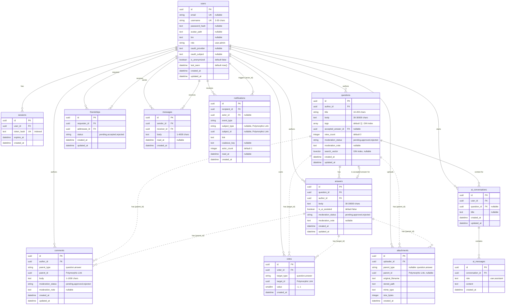

# Knowly Data Model

This document outlines the database schema and data models for the Knowly FastAPI backend. The application relies on a relational model utilizing 12 core tables mapping to SQLAlchemy models. 

## Entity-Relationship Diagram

## Relationship Summary

| From | To | Type | FK / mechanism | On delete |
| :--- | :--- | :--- | :--- | :--- |
| **sessions** | **users** | N:1 | `user_id` | CASCADE |
| **questions** | **users** | N:1 | `author_id` | RESTRICT |
| **questions** | **answers** | 1:1 | `accepted_answer_id` | SET NULL |
| **answers** | **questions** | N:1 | `question_id` | CASCADE |
| **answers** | **users** | N:1 | `author_id` | RESTRICT |
| **comments** | **users** | N:1 | `author_id` | RESTRICT |
| **comments** | **questions** / **answers** | N:1 | *Polymorphic (`parent_type`, `parent_id`)* | *(Handled in code)* |
| **votes** | **users** | N:1 | `voter_id` | CASCADE |
| **votes** | **questions** / **answers** | N:1 | *Polymorphic (`target_type`, `target_id`)* | *(Handled in code)* |
| **attachments** | **users** | N:1 | `uploader_id` | CASCADE |
| **attachments** | **questions** / **answers** | N:1 | *Polymorphic (`parent_type`, `parent_id`)* | *(Handled in code)* |
| **ai_conversations** | **users** | N:1 | `user_id` | CASCADE |
| **ai_conversations** | **questions** | N:1 | `question_id` | SET NULL |
| **ai_messages** | **ai_conversations** | N:1 | `conversation_id` | CASCADE |
| **friendships** | **users** | N:1 | `requester_id` | CASCADE |
| **friendships** | **users** | N:1 | `addressee_id` | CASCADE |
| **messages** | **users** | N:1 | `sender_id` | CASCADE |
| **messages** | **users** | N:1 | `receiver_id` | CASCADE |
| **notifications** | **users** | N:1 | `recipient_id` | CASCADE |
| **notifications** | **users** | N:1 | `actor_id` | SET NULL |

## Models

### 1. `users` (User)
**Purpose**: Central user entity storing authentication and profile data.
- Constraints: `username` length between 3 and 30, `bio` length <= 500, `role` must be 'user' or 'admin'. OAuth provider/subject must either both be null or both populated.
- Relationships: Authors questions, answers, comments; votes; sends/receives messages, notifications, friendships; starts AI conversations.

### 2. `sessions` (Session)
**Purpose**: Stores hashed session tokens for user authentication.
- Constraints: `token_hash` is unique and indexed. `expires_at` tracks validity.

### 3. `questions` (Question)
**Purpose**: Represents a question posted by a user.
- Constraints: `title` length 10-200, `body` length 30-30000, max 5 `tags`. Moderation status must be pending, approved, or rejected. Contains GIN indexes for tags and `search_vector`.
- Relationships: Belongs to an author (User), contains many Answers, references an `accepted_answer_id`.

### 4. `answers` (Answer)
**Purpose**: Represents an answer to a question.
- Constraints: `body` length 30-30000. Moderation status must be pending, approved, or rejected. 
- Relationships: Belongs to a Question (CASCADE delete) and Author (RESTRICT delete).

### 5. `comments` (Comment)
**Purpose**: Threaded comments on questions or answers.
- Constraints: Polymorphic `parent_type` must be 'question' or 'answer'. `body` length 1-1000.
- Relationships: Author (User, RESTRICT). Code must manually handle CASCADE deletes when a parent question/answer is removed.

### 6. `votes` (Vote)
**Purpose**: Tracks upvotes (+1) and downvotes (-1).
- Constraints: Polymorphic `target_type` must be 'question' or 'answer'. Unique constraint on (`voter_id`, `target_type`, `target_id`) ensures a user can only vote once per entity.

### 7. `attachments` (Attachment)
**Purpose**: Tracks uploaded files (e.g. images) linked to questions/answers.
- Constraints: `parent_type` can be NULL (orphan attachment) or 'question'/'answer'. Orphan attachments are indexed for cleanup.

### 8. `ai_conversations` (AiConversation)
**Purpose**: Represents a chat thread between a user and the AI assistant.
- Relationships: Belongs to a User. Optionally references a context Question.

### 9. `ai_messages` (AiMessage)
**Purpose**: Stores individual messages in an AI conversation thread.
- Constraints: `role` must be 'user' or 'assistant'. 

### 10. `friendships` (Friendship)
**Purpose**: Manages connections/friendships between users.
- Constraints: Unique pair across (`requester_id`, `addressee_id`) using `LEAST`/`GREATEST` functions. User cannot friend themselves. `status` must be pending, accepted, or rejected.

### 11. `messages` (Message)
**Purpose**: Direct peer-to-peer user messaging.
- Constraints: `body` length 1-4000. Tracks read receipts via `read_at`.

### 12. `notifications` (Notification)
**Purpose**: In-app notifications to alert users of events.
- Constraints: Uses `coalesce_key` to optionally group/batch similar unread notifications (unique index handles this). `actor_count` can track multiple actors performing the same event type.

## Rules & Gotchas

1. **Polymorphic Relationships**: The database relies on "soft" generic foreign keys for `comments`, `votes`, `attachments`, and `notifications`. Because these target multiple tables (`questions`, `answers`), standard database-level `ON DELETE CASCADE` foreign keys do not apply. The application layer must handle cascading deletions natively via lifecycle hooks or specific `delete_*` functions.
2. **Denormalization (Votes & Views)**: Upvotes/downvotes are strictly stored in the `votes` table. `questions` and `answers` do not appear to have denormalized `score` columns, meaning aggregate sums must be joined or computed on the fly. `questions` does, however, maintain a denormalized `view_count`.
3. **Soft Deletions**: Deletion behavior largely revolves around CASCADE and RESTRICT. An interesting pattern is that authors cannot be deleted if they have answers or comments (`RESTRICT`), while sessions and friendships delete automatically (`CASCADE`) if a user leaves.
4. **Moderation Flow**: `questions`, `answers`, and `comments` all enforce a strict moderation state machine via `CHECK` constraints (`pending`, `approved`, `rejected`), with an optional `moderation_note`. The default state at creation is `'approved'`.
5. **Circular Dependency (Question & Answer)**: `questions` relies on an `accepted_answer_id` pointing to `answers`, and `answers` relies on a `question_id` pointing to `questions`. SQLAlchemy handles this with `post_update=True` and `use_alter=True` on the `accepted_answer_id` FK.
6. **Unique Friendships**: Bidirectional relationships are constrained using a unique index on `LEAST(requester_id, addressee_id)` and `GREATEST(requester_id, addressee_id)`.
7. **OAuth Constraint**: In `users`, OAuth is handled strictly: either both `oauth_provider` and `oauth_subject` are populated, or neither are. Users can thus be entirely password-based or entirely OAuth-based.
